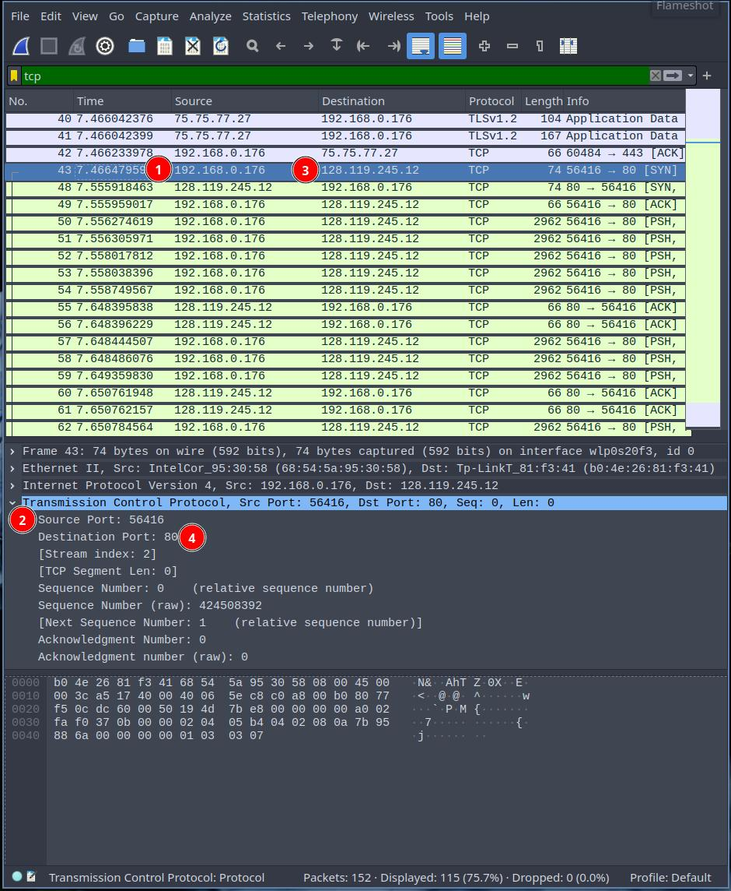
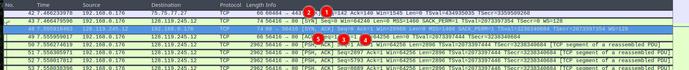
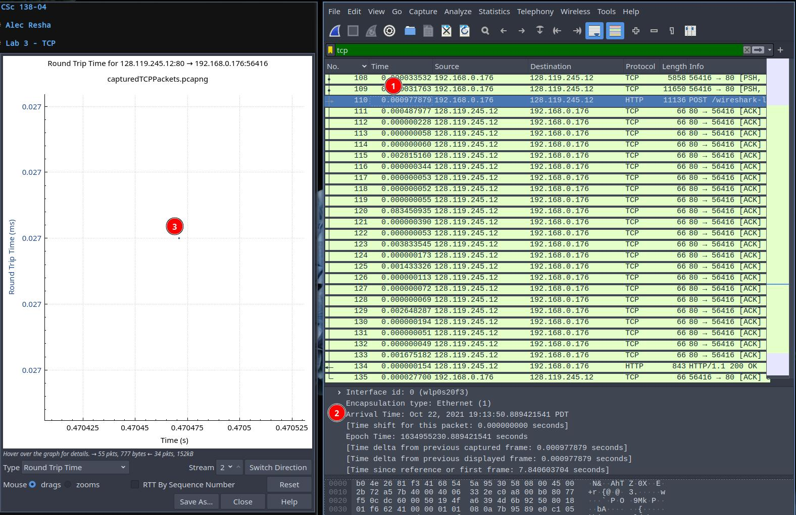
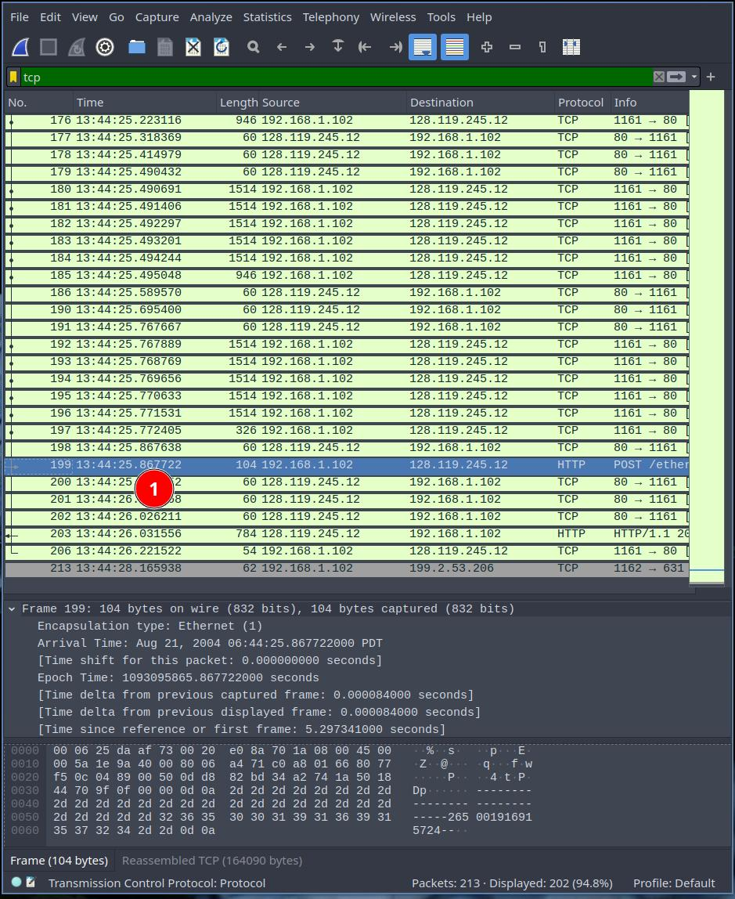
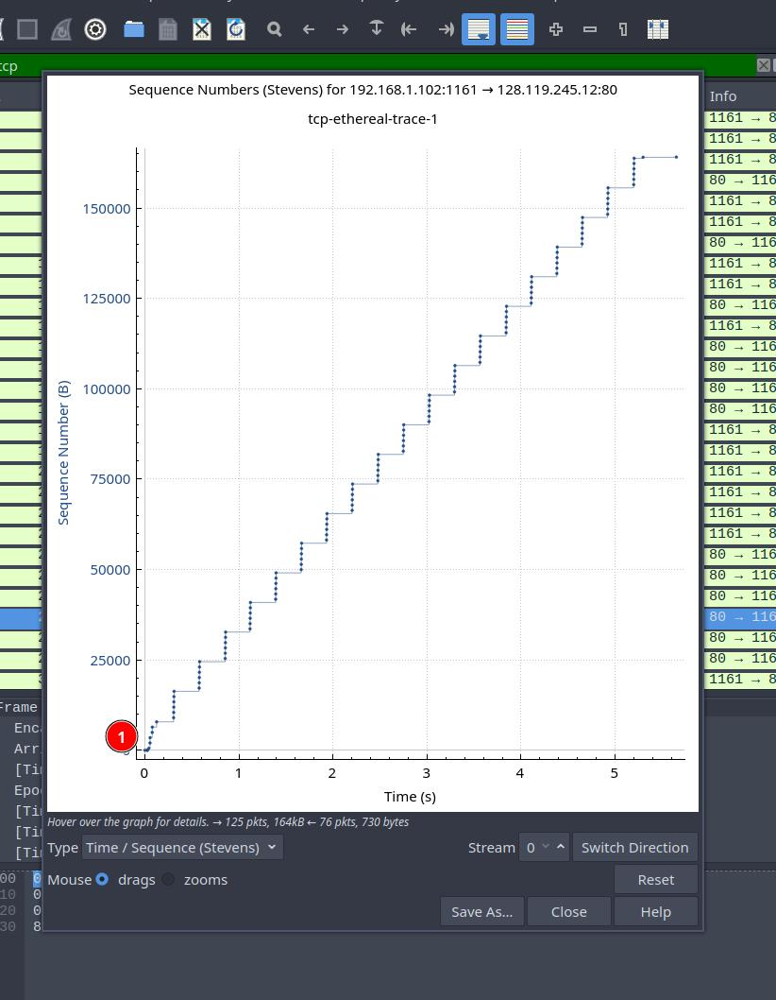
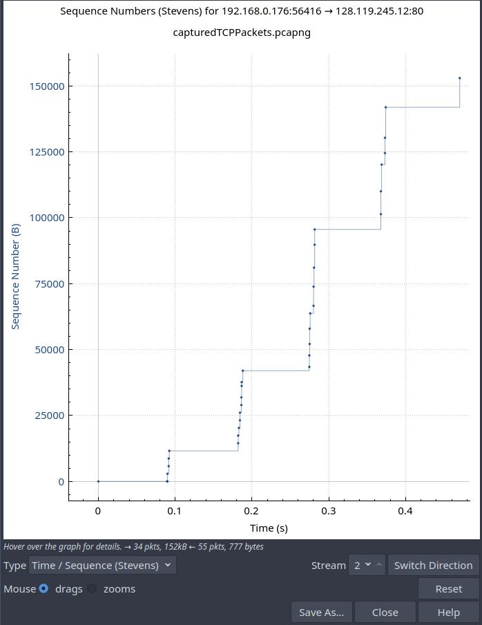

# CSc 138-04

## Alec Resha

## Lab 3 - TCP

1. IP Address and port of source
    - IP Address: 192.168.1.102
    - Source: 1161
2. IP Address and port on gaia.umass.edu
    - IP Address: 128.119.245.12 (3)
    - Port: 80 (4)
3. IP Address and TCP Port from Source
    - IP Address: 192.168.0.176 (1)
    - Port: 56416 (2)

4. Initiate TCP
    - Sequence number: 0 (1)
    - [SYN] Tag marks it as a Syn segment (2)
5. Response from server
    - Sequence number: 0 (3)
    - ACK value: 1 (4) Determined since it is the first ACK tag
    - [SYN, ACK] tag in info signals it as SYNACK (5)

6. First POST
    - Sequence number: 141905

7. 6 Connections of TCP
    - Sequence Number for next 5: 1
    - See screenshot for times (1&2)
    - See screenshot for RTT (3)

8. Length of TCP packets (switched to using TCP-ethereal-trace-1 file due to incorrect lengths)
    - Segment 1: 104
    - Segment 2: 60
    - Segment 3: 60
    - Segment 4: 60

9. Calculated window size: 64256 bytes. Lack of receiver buffer space never throttles sender.
10. No, looked for repeated sequence numbers
11. Primarly at 60 bytes(see number 8)
12. Total size: 177851 bytes. Total time: 7.596. Avg throughput = total size / total time = 23413.77 bytes/sec
13. Yes, slowstart period is from 0 to 0.13 seconds, congestion avoidance begins after this.

14. Slowstart period from 0 to about 0.09, congestion avoidance around .1 second.

